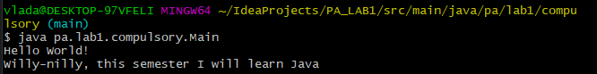
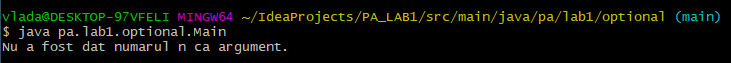

# Advanced Programming - Lab 1

This repository contains all the problems proposed for the first laboratory in Advanced Programming course 
solved by me.

## Essential tools

You need to have Java RE or JDK >= 8 installed on your computer.

## How to run it?

1. Open project with IntelliJ IDEA 

Clone this repository and open it with IntelliJ IDEA. Build this project
(shortcut Ctrl+F9) then go to Run->Run...(shortcut Alt+Shift+F10) and select
the file you want to run.

2. Compile and run the programs using CMD

Go to the folder where the file is located. Open a new terminal here.

If you want to compile the file the file Main.java you must type the command.

```bash
javac -d . Main.java
```

After you compiled it, if you want to start the program you can type the
following command

```bash
java packageName.Main
```

where to packageName is the name of the package which includes the file Main.java.

## Tasks

### Compulsory 

- [x] Display on the screen the message "Hello World!". Run the application. If it works, go to step 2 :) 
- [x] Define an array of strings languages, containing {"C", "C++", "C#", "Python", "Go", "Rust", "JavaScript", "PHP", "Swift", "Java"}
- [x] Generate a random integer n: int n = (int) (Math.random() * 1_000_000);
- [x] Compute the result obtained after performing the following calculations:
    - [x] multiply n by 3;
    - [x] add the binary number 10101 to the result;
    - [x] add the hexadecimal number FF to the result;
    - [x] multiply the result by 6;
- [x] Compute the sum of the digits in the result obtained in the previous step. This is the new result. While the new result has more than one digit, continue to sum the digits of the result.
- [x] Display on the screen the message: "Willy-nilly, this semester I will learn " + languages[result].

### Optional 

- [x] Let n be an integer given as a command line argument. Validate the argument!
- [x] Create a n x n matrix, representing the adjacency matrix of a random graph .
- [x] Display on the screen the generated matrix (you might want to use the geometric shapes from the Unicode chart to create a "pretty" representation of the matrix).
- [x] Verify if the generated graph is connected and display the connected components (if it is not).
- [x] Assuming that the generated graph is connected, implement an algorithm that creates a partial tree of the graph. Display the adjacency matrix of the tree.
- [x] For larger n display the running time of the application in nanoseconds (DO NOT display the matrices). Try n > 30_000. You might want to adjust the JVM Heap Space using the VM options -Xms4G -Xmx4G.
- [x] Launch the application from the command line, for example: java Lab1 100.

### Bonus 

- [x] Implement an efficient algorithm that generates a random rooted tree. Create and display a textual representation of the tree, for example:
- 

## Results of the programs

### Compulsory



### Optional

- Exemple 1
  
  

- Exemple 2 : n = 7
  
  

- Exemple 3 : n = 7


  
- Exemple 4 : without printing graph and tree matrix


### Bonus

- Exemple 1


- Exemple 2


- Exemple 3

